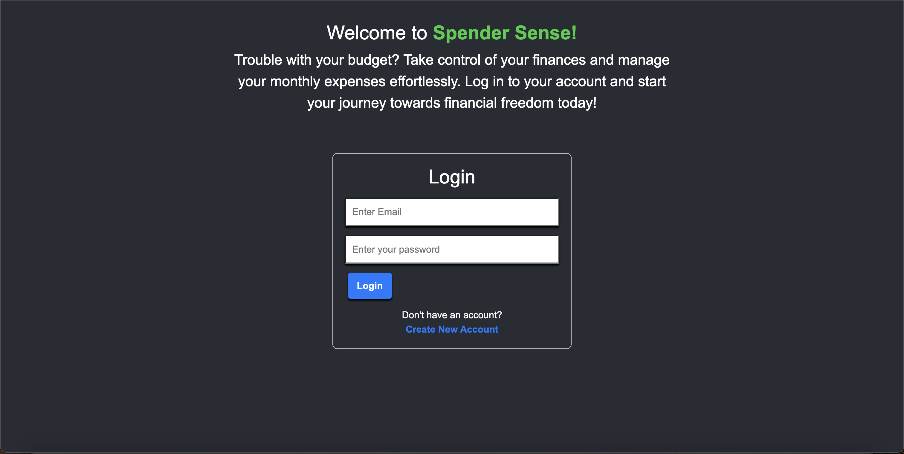

 
 

# income-helper

## Table of Contents
1. [Description](#description)
2. [Usage](#usage)
3. [License](#license)
4. [Screenshot](#screenshot)
5. [Questions](#questions)

## Description
This project was aimed towards creating an expense tracker to assist with creating a budget using React, Node.js, and MongoDB.

## Usage 
To use this application, please visit the site listed at https://spender-sense.onrender.com/ . Once there, you can choose to login with your previously created credentials, or you can create an account using a unique username, email, and password. After you login, you can view or create expense entries and income entries. After you created at least one either expense or income entry, it will display your total monthly income, expenses, and net income on the homepage. 

## License 
Please refer to the license in the GitHub Repository.

## Screenshot 

## Questions 
You can find me [HERE](https://github.com/asoto225) on Github.
You can email me at abelsoto12@hotmail.com if you have any additional questions.